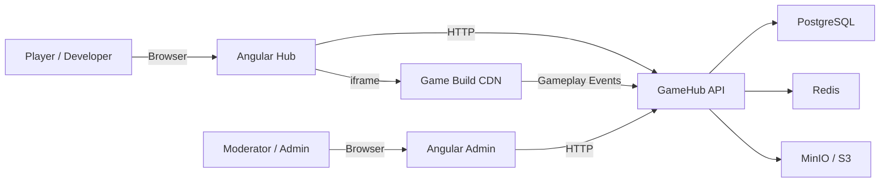

# GameHub — Web Game Distribution Platform

[](https://github.com/afonsoft/gamehub/actions/workflows/ci-build-test.yml)
[](https://github.com/afonsoft/gamehub/actions/workflows/angular-ci.yml)
[](https://github.com/afonsoft/gamehub/actions/workflows/code-quality.yml)
[](LICENSE)

> **GameHub** is an enterprise-grade web game distribution platform for HTML5/WebGL titles. It provides a public game catalog, an iframe-based player with a gameplay bridge, a developer portal for build submission, and an administration module for moderation and publishing.
>
> **Goal**: build a proprietary platform without copying brands, layouts, content, games, assets, or proprietary experiences from third parties.

- [Portuguese version](README.pt-BR.md)
- [Changelog](CHANGELOG.md)

---

## Table of Contents

1. [Project Description](#project-description)
2. [Repository Structure](#repository-structure)
3. [Technology Stack](#technology-stack)
4. [Architecture](#architecture)
5. [System Flow](#system-flow)
6. [How to Run](#how-to-run)
7. [Tests and Coverage](#tests-and-coverage)
8. [Business Vision](#business-vision)
9. [Technical Vision](#technical-vision)
10. [Contributors](#contributors)
11. [License](#license)
12. [Project Status](#project-status)
13. [Links](#links)

---

## Project Description

GameHub is a modular monolith built on top of the EAF/ABP template for .NET. It connects players, developers, moderators, and administrators around a single catalog of web games.

### Personas

| Persona | Capabilities |
|---------|--------------|
| Anonymous Player | Browse, search, play, vote, and report games. |
| Authenticated Player | Profile, **favorites**, **recent games**, **cloud saves**, leaderboards, recommendations, and short game tokens. |
| Developer | Create and submit games, upload builds, and view metrics. |
| Moderator | Review, approve/reject builds, and handle user reports. |
| Administrator | Manage users, roles, feature flags, metrics, and audit logs. |

### Public Features (Game Hub)

- Home page with sections: highlights, new releases, most played, trending, recommendations, **web exclusives**, and categories.
- Game detail page with execution in a sandboxed iframe, like/dislike, report, favorite toggle, and fullscreen support.
- Search and catalog filters by category, tag, device, orientation, **exclusivity**, and **minimum rating**.
- Optional player account with favorites and recent games; anonymous data stays in `localStorage` and merges on login.
- Leaderboards backed by Redis Sorted Sets.
- Ad breaks (commercial/rewarded) with provider abstraction, automatic audio muting, and ad-block handling.
- Cloud save/load with anonymous `localStorage` fallback and `gamehub_ignore_` local-only keys.
- SDK login, `getUser`, and `getToken` for games requiring player identity.
- Adaptive controls (keyboard/touch hints) and ESC/Space pause/resume.
- Skippable cutscenes when `cutscenesSkippable` is enabled.
- In-game language selector and player language preference (`getLanguage`/`setLanguage`).
- Privacy policy display and consent on game detail pages.

### Gameplay SDK / Bridge

The iframe-hosted game communicates with the platform through the following events and actions:

| Event | Description |
|-------|-------------|
| `GameLoadingStarted` | Loading begins. |
| `GameLoadingFinished` | Loading completes. |
| `GameplayStarted` | Player starts the session. |
| `GameplayStopped` | Player pauses or leaves. |
| `CommercialBreakRequested` | Commercial break requested. |
| `CommercialBreakCompleted` | Commercial break finished. |
| `RewardedBreakRequested` | Rewarded ad requested. |
| `RewardedBreakCompleted` | Rewarded ad finished. |
| `AdBreakMute` / `AdBreakUnmute` | Audio muting around ad breaks. |
| `GameErrorCaptured` | Error captured. |
| `GameMeasuredEvent` | Measurement or timing event. |
| `FpsMeasured` | FPS telemetry for performance monitoring. |
| `save` / `load` | Cloud/local player data persistence. |
| `getUser` / `getToken` | Authenticated player profile and short JWT. |
| `getPrivacyPolicy` | Hosted privacy policy for the game. |
| `controlScheme` | Primary input scheme sent to the game. |
| `pauseRequested` / `resumeRequested` | ESC/Space keyboard events. |
| `getLanguage` / `setLanguage` | Player language preference and game language change. |

### Developer Portal

- Five-step submission wizard.
- HTML5/WebGL build upload (zip/tar) with mandatory validation.
- Validations: `index.html` required, maximum size (100 MB), SHA-256 hash, and no executables (`.exe`, `.dll`, `.bat`, `.cmd`, `.ps1`).
- Immutable versioning (semver) and CDN publication after approval.

### Moderation & Publishing (Admin)

- Review queue with approve/reject actions.
- Game publish/suspend workflow.
- Report queue and auditable moderation history.
- Build validation warnings for external requests, large files, and outgoing links.
- **Inspector de QA v2**: SDK event timeline, warnings, and scaling tests per session.
- FPS-based performance alerts and daily metric snapshots.
- UGC moderation with profanity filtering.

---

## Repository Structure

```
gamehub/
├── Api/                                    # .NET backend
│   ├── src/
│   │   ├── GameHub.Core/                  # Domain layer (entities, value objects, enums)
│   │   ├── GameHub.Application/           # Application services and DTOs
│   │   ├── GameHub.EntityFrameworkCore/   # DbContext, migrations, EF Fluent API
│   │   ├── GameHub.Web.Host/              # Host, Startup, middleware, controllers
│   │   └── GameHub.Migrator/              # Migration runner
│   ├── test/
│   │   ├── GameHub.Tests/                 # xUnit domain and application tests
│   │   └── GameHub.Web.Tests/             # Web/integration tests
│   ├── GameHub.sln                        # Solution file
│   └── Dockerfile                         # API container image
├── angular/                               # Public Game Hub (Angular 20+)
├── angular-admin/GameHub.UI/              # Administration UI (Angular 20+)
├── docker-compose.infra.yml               # Local infrastructure (PostgreSQL, Redis, MinIO)
├── docker-compose.yml                     # API + Angular Hub + Angular Admin (requires external infra)
├── docker-compose.all.yml                 # Full stack (infra + API + Angular Hub + Angular Admin)
├── .env.example                           # Example environment variables
├── scripts/                               # Local build, test, and run scripts
├── docs/                                  # Execution log and known issues
├── .github/workflows/                     # CI/CD pipelines
├── .specs/                                # Detailed platform specifications
├── README.md                              # This file (en-US)
├── README.pt-BR.md                        # Portuguese version
└── CHANGELOG.md                           # Version history
```

---

## Technology Stack

| Layer | Technologies |
|-------|--------------|
| **Backend API** | .NET 10 LTS, ASP.NET Core, EAF/ABP 10.4, EF Core, AutoMapper, Hangfire |
| **Game Hub Frontend** | Angular 20+, TypeScript strict, RxJS, custom design system |
| **Admin Frontend** | Angular 20+, TypeScript strict, RxJS, PrimeNG, Bootstrap |
| **Database** | PostgreSQL 16+ (preferred) or SQL Server 2022+ |
| **Cache** | Redis 7+ (catalog, rate limiting, leaderboards, distributed locks) |
| **Storage** | S3/MinIO/Azure Blob (builds, thumbnails, screenshots) |
| **Observability** | Serilog (JSON logs), OpenTelemetry (traces + metrics), CorrelationId |
| **Containers** | Docker, Docker Compose |
| **Security** | JWT/OIDC, RBAC (ABP), CSP, iframe sandbox, CORS, LGPD |
| **Tests** | xUnit, Shouldly |

> **Not used**: FluentValidation (ABP native validation), MediatR (ABP native CQRS).

---

## Architecture

**Modular Monolith** with **Clean Architecture + DDD** on the EAF/ABP template.

### Layers

```
Api/src/
  GameHub.Core                → Domain (entities, value objects, repositories)
  GameHub.Application         → Use cases (application services)
  GameHub.Application.Shared  → DTOs, permissions, feature flags
  GameHub.EntityFrameworkCore → DbContext, migrations, configurations
  GameHub.Web.Core            → Middleware, filters, security
  GameHub.Web.Host            → Controllers, startup
  GameHub.Migrator            → Migration runner
```

### Dependency Direction

```
Core ← Application ← Infrastructure
Web  ← Application
```

- Never: Core → Infrastructure, Core → Web, Application → Web.

### Bounded Contexts

1. **Catalog** — `Game`, `Category`, `Tag`, `GamePlacement`
2. **Build Management** — `GameBuild`, build validation
3. **Gameplay Analytics** — `PlaySession`, `GameplayEvent`, `GameMetricSnapshot`
4. **Developer Portal** — `DeveloperProfile`, game submission
5. **Moderation** — `ModerationReview`, `UserReport`
6. **Monetization** — `IAdProvider`, `AdBreakResult`, revenue share, and `WebExclusive` discovery

### System Flow



---

## How to Run

### Prerequisites

- [.NET 10 SDK](https://dotnet.microsoft.com/)
- [Node.js 20+](https://nodejs.org/)
- [Docker](https://www.docker.com/) and [Docker Compose](https://docs.docker.com/compose/)
- `git`

### Backend Only

```bash
# Build
dotnet build Api/GameHub.sln

# Run tests
dotnet test Api/GameHub.sln

# Run API (requires PostgreSQL and Redis)
dotnet run --project Api/src/GameHub.Web.Host
```

### Install Script (API + Admin + Hub)

Use o script `install.sh` para subir apenas a aplicação (API, Hub e Admin) sem a infraestrutura. Requisito: PostgreSQL, Redis e (opcionalmente) MinIO devem estar rodando previamente, por exemplo via `docker compose -f docker-compose.infra.yml up -d`.

```bash
./install.sh
```

Comportamento:

- Se o arquivo `.env` **não existir**, o script cria um `.env` com todas as variáveis preenchidas com `A PREENCHER`, executa `docker compose pull` e `docker compose build`, e **não sobe os containers**. Edite o `.env` e execute o script novamente.
- Se o arquivo `.env` **já existir**, o script executa `pull`, `build` e `up -d`.
- Para forçar o rebuild das imagens sem cache e recriar os containers, use a flag `-r`:

```bash
./install.sh -r
```

Para subir manualmente a infraestrutura antes do script:

```bash
# Start infrastructure (PostgreSQL, Redis, MinIO)
docker compose -f docker-compose.infra.yml up -d

# Then run the install script
./install.sh
```

### Full Stack with Docker Compose

```bash
# Copy example environment variables
cp .env.example .env

# Start infrastructure (PostgreSQL, Redis, MinIO)
docker compose -f docker-compose.infra.yml up -d

# Option 1: start application using external/host infrastructure
docker compose -f docker-compose.yml up --build -d

# Option 2: start the full stack (infrastructure + application)
# docker compose -f docker-compose.all.yml up --build -d
```

### Local URLs

| Service | URL |
|---------|-----|
| API | http://localhost:4601 |
| Game Hub | http://localhost:4600 |
| Admin | http://localhost:4602 |
| MinIO Console | http://localhost:9001 |

### DNS de produção (conforme `.specs`)

| Serviço | DNS |
|---------|-----|
| Game Hub | `gamehub.afonsoft.dev` |
| API | `gamehub-api.afonsoft.dev` |
| Admin | `gamehub-admin.afonsoft.dev` |
| Sandbox dos jogos | `games.afonsoft.dev` |

Para testar localmente com esses domínios, aponte-os para `127.0.0.1` no `/etc/hosts`:

```
127.0.0.1 gamehub.afonsoft.dev
127.0.0.1 gamehub-api.afonsoft.dev
127.0.0.1 gamehub-admin.afonsoft.dev
127.0.0.1 games.afonsoft.dev
```

O nginx já configurado deve fazer proxy para os upstreams locais:

- `gamehub.afonsoft.dev` → `http://127.0.0.1:4600`
- `gamehub-api.afonsoft.dev` → `http://127.0.0.1:4601`
- `gamehub-admin.afonsoft.dev` → `http://127.0.0.1:4602`

As variáveis `GAMEHUB_API_URL`, `GAMEHUB_HUB_URL`, `GAMEHUB_ADMIN_URL` e `GAMEHUB_CORS_ORIGINS` no `.env` permitem sobrescrever as URLs públicas (útil para http/local ou outro domínio).

---

## Tests and Coverage

### Commands

```bash
# .NET tests
dotnet test Api/GameHub.sln

# Backend coverage (XPlat Code Coverage)
dotnet test Api/GameHub.sln --collect:"XPlat Code Coverage" --results-directory ./TestResults

# Angular builds
cd angular && npm ci && npm run build
cd angular-admin/GameHub.UI && npm ci && npm run build
```

### Current Results

| Suite | Status | Count |
|-------|--------|-------|
| GameHub.Tests | Pass | 242 passed, 2 skipped |
| GameHub.Web.Tests | Pass | 0 passed, 1 skipped |
| Angular Hub Build | Pass | production build OK |
| Angular Admin Build | Pass | production build OK |

### Coverage Snapshot

Measured with `dotnet test --collect:"XPlat Code Coverage"` and `GameHub.*` assembly filter:

| Assembly | Line Rate | Branch Rate |
|----------|-----------|-------------|
| GameHub.Core | 56.23% | — |
| GameHub.Application | 29.03% | — |
| GameHub.EntityFrameworkCore | 5.93% | — |
| GameHub.Web.Host | 4.88% | — |
| **Overall** | **10.22%** | **28.84%** |

> The overall rate is low because the platform is in early development. The coverage target is 90% line/branch; new domain and application tests should be added incrementally.

---

## Business Vision

GameHub aims to become an independent, scalable web game distribution platform where developers can publish HTML5/WebGL titles and players can discover and play them directly in the browser. The platform prioritizes:

- **Self-ownership** of catalog, ads, and revenue distribution.
- **Developer empowerment** with transparent submission and moderation workflows.
- **Player trust** through sandboxed gameplay, content moderation, and privacy compliance.
- **Operational readiness** with multi-tenancy, auditing, and observability built-in.

---

## Technical Vision

- **Clean Architecture + DDD** keeps domain logic independent of frameworks and UI.
- **EAF/ABP** provides multi-tenancy, RBAC, localization, and audit logging out of the box.
- **PostgreSQL + Redis** support relational data and high-throughput cache/ranking workloads.
- **Docker Compose** enables consistent local development and future cloud deployment.
- **OpenTelemetry + Serilog** enable structured observability from day one.
- **Modular frontends** separate the public catalog from the administration interface while sharing the same API contracts.

---

## Contributors

- Afonso Dutra Nogueira Filho — [afonsoft](https://github.com/afonsoft)

---

## License

GPL-3.0-or-later. See [LICENSE](LICENSE) for details.

---

## Project Status

In active development. The domain model, application layer, EF Core infrastructure, security middleware, public Angular frontend, player accounts, web-exclusives discovery, ad-provider abstraction, inspector QA v2, privacy/UGC/performance features, and FPS telemetry are implemented. Remaining work includes Redis-backed production caches, full MinIO/S3 integration for build storage, and advanced recommendation algorithms.

---

## Agent Tools & Automation

This repository includes an agent harness (`.claude/` + `.devin/`) and is linked to the central `afonsoft/agents-skills` catalog.

- [AGENTS.md](AGENTS.md) — agent mission, rules, and workflow.
- [CLAUDE.md](CLAUDE.md) — Claude Code / Devin CLI configuration.
- [.claude/MEMORY.md](.claude/MEMORY.md) — cross-session decisions and available tools.
- [.specs/](.specs/) — detailed platform specifications.

Available agent tools include Devin native tools, MCP servers (`deepwiki`, `firecrawl`, `microsoft-learn`, `monday`, `notion`, `sonarqube`, `tavily`), and reusable skills for .NET/ABP/Angular/PostgreSQL.

## Links

- [Portuguese README](README.pt-BR.md)
- [Changelog](CHANGELOG.md)
- [Agent Execution Log](docs/agent-execution-log.md)
- [Known Issues](docs/known-issues.md)
- [Specifications](.specs/)
