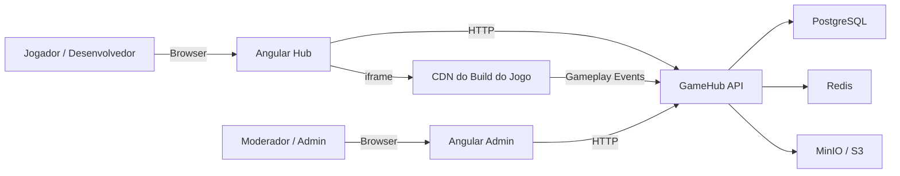

# GameHub — Plataforma de Distribuição de Jogos Web

[](https://github.com/afonsoft/gamehub/actions/workflows/ci-build-test.yml)
[](https://github.com/afonsoft/gamehub/actions/workflows/angular-ci.yml)
[](https://github.com/afonsoft/gamehub/actions/workflows/code-quality.yml)
[](LICENSE)

> **GameHub** é uma plataforma enterprise-grade de catálogo, execução e gestão de jogos HTML5/WebGL. Oferece um catálogo público de jogos, execução em iframe com gameplay bridge, um portal do desenvolvedor para envio de builds e um módulo administrativo para moderação e publicação.
>
> **Objetivo**: construir uma plataforma própria, sem copiar marcas, layouts, conteúdo, jogos, assets ou experiências proprietárias de terceiros.

- [Versão em inglês](README.md)
- [Changelog](CHANGELOG.md)

---

## Sumário

1. [Descrição do Projeto](#descrição-do-projeto)
2. [Estrutura do Repositório](#estrutura-do-repositório)
3. [Stack Tecnológica](#stack-tecnológica)
4. [Arquitetura](#arquitetura)
5. [Fluxo do Sistema](#fluxo-do-sistema)
6. [Como Rodar](#como-rodar)
7. [Testes e Cobertura](#testes-e-cobertura)
8. [Visão de Negócio](#visão-de-negócio)
9. [Visão Técnica](#visão-técnica)
10. [Contribuidores](#contribuidores)
11. [Licença](#licença)
12. [Status do Projeto](#status-do-projeto)
13. [Links](#links)

---

## Descrição do Projeto

O GameHub é um monolito modular construído sobre o template EAF/ABP para .NET. Conecta jogadores, desenvolvedores, moderadores e administradores em torno de um catálogo único de jogos web.

### Personas

| Persona | Capacidades |
|---------|-------------|
| Jogador Anônimo | Navegar, buscar, jogar, votar e denunciar jogos. |
| Jogador Autenticado | Perfil, **favoritos**, **jogos recentes**, **saves na nuvem**, leaderboards, recomendações e tokens curtos de jogo. |
| Desenvolvedor | Criar e submeter jogos, fazer upload de builds e ver métricas. |
| Moderador | Revisar, aprovar/rejeitar builds e tratar denúncias. |
| Administrador | Gerenciar usuários, roles, feature flags, métricas e auditoria. |

### Funcionalidades Públicas (Game Hub)

- Home com seções: destaques, novidades, mais jogados, tendências, recomendados, **exclusivos web** e categorias.
- Página de detalhe do jogo com execução em iframe sandbox, like/dislike, denúncia, favorito e fullscreen.
- Busca com filtros por categoria, tag, dispositivo, orientação, **exclusividade** e **avaliação mínima**.
- Conta opcional do jogador com favoritos e jogos recentes; dados anônimos ficam no `localStorage` e são mesclados no login.
- Leaderboards com Redis Sorted Sets.
- Ad breaks (comerciais/recompensados) com abstração de provider, mute automático de áudio e tratamento de ad block.
- Save/load na nuvem com fallback em `localStorage` para anônimos e chaves `gamehub_ignore_` locais.
- SDK login, `getUser` e `getToken` para jogos que precisam de identidade do jogador.
- Controles adaptativos (dicas de teclado/touch) e pausa/resume via ESC/Space.
- Cutscenes puláveis quando `cutscenesSkippable` está habilitado.
- Exibição de política de privacidade e consentimento na página do jogo.
- Seletor de idioma in-game e preferência de idioma do jogador (`getLanguage`/`setLanguage`).

### Gameplay SDK / Bridge

O jogo executado no iframe se comunica com a plataforma através dos eventos:

| Evento | Descrição |
|--------|-----------|
| `GameLoadingStarted` | Início do carregamento. |
| `GameLoadingFinished` | Carregamento concluído. |
| `GameplayStarted` | Jogador iniciou a sessão. |
| `GameplayStopped` | Jogador pausou/saiu. |
| `CommercialBreakRequested` | Break comercial solicitado. |
| `CommercialBreakCompleted` | Break comercial finalizado. |
| `RewardedBreakRequested` | Rewarded ad solicitado. |
| `RewardedBreakCompleted` | Rewarded ad finalizado. |
| `AdBreakMute` / `AdBreakUnmute` | Mute de áudio durante ad breaks. |
| `GameErrorCaptured` | Erro capturado. |
| `GameMeasuredEvent` | Evento de medição ou timing. |
| `FpsMeasured` | Telemetria de FPS para monitoramento de performance. |
| `save` / `load` | Persistência de dados do jogador na nuvem/local. |
| `getUser` / `getToken` | Perfil do jogador autenticado e JWT curto. |
| `getPrivacyPolicy` | Política de privacidade hospedada do jogo. |
| `controlScheme` | Esquema de controle primário enviado ao jogo. |
| `pauseRequested` / `resumeRequested` | Eventos de teclado ESC/Space. |
| `getLanguage` / `setLanguage` | Preferência de idioma do jogador e mudança de idioma do jogo. |

### Portal do Desenvolvedor

- Wizard de submissão em 5 etapas.
- Upload de builds HTML5/WebGL (zip/tar) com validação obrigatória.
- Validações: `index.html` obrigatório, tamanho máximo (100 MB), hash SHA-256 e sem executáveis (`.exe`, `.dll`, `.bat`, `.cmd`, `.ps1`).
- Versionamento imutável (semver) e publicação no CDN após aprovação.

### Moderação & Publicação (Admin)

- Fila de revisão com aprovação/rejeição.
- Workflow de publicação/suspensão de jogos.
- Fila de denúncias e histórico auditável de moderação.
- Avisos de validação de builds para requests externos, arquivos grandes e links externos.
- **Inspector de QA v2**: timeline de eventos SDK, warnings e scaling tests por sessão.
- Alertas de performance baseados em FPS e snapshots diários de métricas.
- Moderação de UGC com filtro de profanidade.

---

## Estrutura do Repositório

```
gamehub/
├── Api/                                    # Backend .NET
│   ├── src/
│   │   ├── GameHub.Core/                  # Camada de domínio (entidades, value objects, enums)
│   │   ├── GameHub.Application/           # Application services e DTOs
│   │   ├── GameHub.EntityFrameworkCore/   # DbContext, migrations e Fluent API
│   │   ├── GameHub.Web.Host/              # Host, Startup, middleware, controllers
│   │   └── GameHub.Migrator/              # Runner de migrações
│   ├── test/
│   │   ├── GameHub.Tests/                 # Testes xUnit (domínio e aplicação)
│   │   └── GameHub.Web.Tests/             # Testes web/integração
│   ├── GameHub.sln                        # Arquivo de solution
│   └── Dockerfile                         # Imagem de container da API
├── angular/                               # Game Hub público (Angular 20+)
├── angular-admin/GameHub.UI/              # UI administrativa (Angular 20+)
├── docker-compose.infra.yml               # Infraestrutura local (PostgreSQL, Redis, MinIO)
├── docker-compose.yml                     # API + Angular Hub + Angular Admin (requer infra externa)
├── docker-compose.all.yml                 # Stack completa (infra + API + Angular Hub + Angular Admin)
├── .env.example                           # Variáveis de ambiente de exemplo
├── scripts/                               # Scripts locais de build, teste e execução
├── docs/                                  # Log de execução e issues conhecidas
├── .github/workflows/                     # Pipelines de CI/CD
├── .specs/                                # Especificações detalhadas da plataforma
├── README.md                              # Versão em inglês
├── README.pt-BR.md                        # Este arquivo
└── CHANGELOG.md                           # Histórico de versões
```

---

## Stack Tecnológica

| Camada | Tecnologias |
|--------|-------------|
| **Backend API** | .NET 10 LTS, ASP.NET Core, EAF/ABP 10.4, EF Core, AutoMapper, Hangfire |
| **Frontend Game Hub** | Angular 20+, TypeScript strict, RxJS, design system próprio |
| **Frontend Admin** | Angular 20+, TypeScript strict, RxJS, PrimeNG, Bootstrap |
| **Banco** | PostgreSQL 16+ (preferencial) ou SQL Server 2022+ |
| **Cache** | Redis 7+ (catálogo, rate limiting, leaderboards, locks distribuídos) |
| **Storage** | S3/MinIO/Azure Blob (builds, thumbnails, screenshots) |
| **Observabilidade** | Serilog (logs JSON), OpenTelemetry (traces + métricas), CorrelationId |
| **Containers** | Docker, Docker Compose |
| **Segurança** | JWT/OIDC, RBAC (ABP), CSP, iframe sandbox, CORS, LGPD |
| **Testes** | xUnit, Shouldly |

> **Não usar**: FluentValidation (validação nativa do ABP), MediatR (CQRS nativo do ABP).

---

## Arquitetura

**Monolito Modular** com **Clean Architecture + DDD** sobre o template EAF/ABP.

### Camadas

```
Api/src/
  GameHub.Core                → Domínio (entidades, value objects, repositórios)
  GameHub.Application         → Casos de uso (application services)
  GameHub.Application.Shared  → DTOs, permissões, feature flags
  GameHub.EntityFrameworkCore → DbContext, migrations, configurações
  GameHub.Web.Core            → Middleware, filters, segurança
  GameHub.Web.Host            → Controllers, startup
  GameHub.Migrator            → Runner de migrações
```

### Direção de Dependências

```
Core ← Application ← Infrastructure
Web  ← Application
```

- Jamais: Core → Infrastructure, Core → Web, Application → Web.

### Bounded Contexts

1. **Catalog** — `Game`, `Category`, `Tag`, `GamePlacement`
2. **Build Management** — `GameBuild`, validação de builds
3. **Gameplay Analytics** — `PlaySession`, `GameplayEvent`, `GameMetricSnapshot`
4. **Developer Portal** — `DeveloperProfile`, submissão de jogos
5. **Moderation** — `ModerationReview`, `UserReport`
6. **Monetização** — `IAdProvider`, `AdBreakResult`, revenue share e descoberta de `WebExclusive`

### Fluxo do Sistema



---

## Como Rodar

### Pré-requisitos

- [.NET 10 SDK](https://dotnet.microsoft.com/)
- [Node.js 20+](https://nodejs.org/)
- [Docker](https://www.docker.com/) e [Docker Compose](https://docs.docker.com/compose/)
- `git`

### Apenas Backend

```bash
# Build
dotnet build Api/GameHub.sln

# Testes
dotnet test Api/GameHub.sln

# Rodar API (requer PostgreSQL e Redis)
dotnet run --project Api/src/GameHub.Web.Host
```

### Stack Completa com Docker Compose

```bash
# Copiar variáveis de ambiente de exemplo
cp .env.example .env

# Subir infraestrutura (PostgreSQL, Redis, MinIO)
docker compose -f docker-compose.infra.yml up -d

# Opção 1: subir aplicação com infra externa/host
docker compose -f docker-compose.yml up --build -d

# Opção 2: subir stack completa (infra + aplicação)
# docker compose -f docker-compose.all.yml up --build -d
```

### URLs Locais

| Serviço | URL |
|---------|-----|
| API | http://localhost:5000 |
| Game Hub | http://localhost:4200 |
| Admin | http://localhost:4201 |
| Console MinIO | http://localhost:9001 |

---

## Testes e Cobertura

### Comandos

```bash
# Testes .NET
dotnet test Api/GameHub.sln

# Cobertura do backend (XPlat Code Coverage)
dotnet test Api/GameHub.sln --collect:"XPlat Code Coverage" --results-directory ./TestResults

# Builds Angular
cd angular && npm ci && npm run build
cd angular-admin/GameHub.UI && npm ci && npm run build
```

### Resultados Atuais

| Suite | Status | Quantidade |
|-------|--------|------------|
| GameHub.Tests | Pass | 242 passados, 2 skipped |
| GameHub.Web.Tests | Pass | 0 passados, 1 skipped |
| Angular Hub Build | Pass | build de produção OK |
| Angular Admin Build | Pass | build de produção OK |

### Snapshot de Cobertura

Medido com `dotnet test --collect:"XPlat Code Coverage"` e filtro de assemblies `GameHub.*`:

| Assembly | Line Rate | Branch Rate |
|----------|-----------|-------------|
| GameHub.Core | 56,23% | — |
| GameHub.Application | 29,03% | — |
| GameHub.EntityFrameworkCore | 5,93% | — |
| GameHub.Web.Host | 4,88% | — |
| **Geral** | **10,22%** | **28,84%** |

> A cobertura geral está baixa porque a plataforma está em desenvolvimento inicial. O target é 90% line/branch; novos testes de domínio e aplicação devem ser adicionados incrementalmente.

---

## Visão de Negócio

O GameHub visa se tornar uma plataforma independente e escalável de distribuição de jogos web, onde desenvolvedores publicam títulos HTML5/WebGL e jogadores os descobrem e jogam diretamente no navegador. A plataforma prioriza:

- **Propriedade própria** do catálogo, ads e distribuição de receita.
- **Empoderamento do desenvolvedor** com workflows transparentes de submissão e moderação.
- **Confiança do jogador** através de gameplay sandbox, moderação de conteúdo e conformidade com privacidade.
- **Prontidão operacional** com multi-tenancy, auditoria e observabilidade integrados.

---

## Visão Técnica

- **Clean Architecture + DDD** mantêm a lógica de domínio independente de frameworks e UI.
- **EAF/ABP** fornece multi-tenancy, RBAC, localização e auditoria out of the box.
- **PostgreSQL + Redis** suportam dados relacionais e workloads de cache/ranking de alto throughput.
- **Docker Compose** permite desenvolvimento local consistente e futuro deploy em nuvem.
- **OpenTelemetry + Serilog** permitem observabilidade estruturada desde o primeiro dia.
- **Frontends modulares** separam o catálogo público da interface administrativa, consumindo os mesmos contratos da API.

---

## Contribuidores

- Afonso Dutra Nogueira Filho — [afonsoft](https://github.com/afonsoft)

---

## Licença

GPL-3.0-or-later. Veja [LICENSE](LICENSE) para detalhes.

---

## Status do Projeto

Em desenvolvimento ativo. O modelo de domínio, camada de aplicação, infraestrutura EF Core, middlewares de segurança, frontend Angular público, contas de jogador, descoberta de exclusivos web, abstração de ad provider, Inspector QA v2, recursos de privacidade/UGC/desempenho e telemetria de FPS estão implementados. Trabalho restante inclui caches produtivos com Redis, integração MinIO/S3 para armazenamento de builds e algoritmos avançados de recomendação.

---

## Links

- [README em inglês](README.md)
- [Changelog](CHANGELOG.md)
- [Agent Execution Log](docs/agent-execution-log.md)
- [Known Issues](docs/known-issues.md)
- [Especificações](.specs/)
